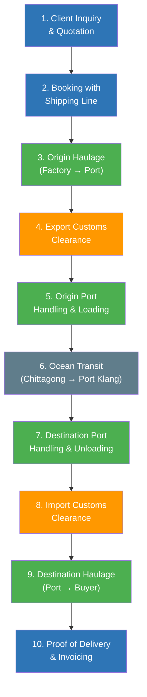
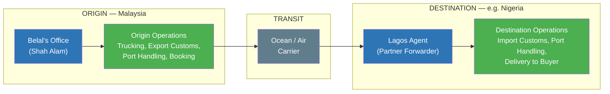

# Module 1 — The Freight Forwarding Universe

## Freight Forwarding Operations Course
**Prepared for:** Dr. Nazmul Alam  
**Course Goal:** Equip you to operate inside a freight forwarding business  
**Date:** April 2026

---

## 1.1 What Is a Freight Forwarder?

A freight forwarder is an **orchestrator of cargo movement**. They coordinate carriers, customs brokers, warehouse operators, and agents to move cargo from origin to destination — without owning ships, planes, or trucks themselves.

### Key Principle
> **The forwarder never touches the cargo.** The trucker touches it. The port workers handle it. The shipping line carries it. The warehouse staff store it. The forwarder coordinates all of these parties — but physically handles zero cartons across the entire shipment lifecycle.

### What the Forwarder Sells
A freight forwarder's product is not physical — it is:

| What They Sell | What It Means |
|---|---|
| **Knowledge** | Which carrier has the best rate? Which route is fastest? What documents does customs require? |
| **Relationships** | Negotiated volume rates with shipping lines, trusted trucking partners, reliable customs brokers |
| **Coordination** | Making 10+ steps happen in the right sequence, at the right time, without the client worrying |
| **Access** | Discounted carrier rates (from volume), global reach through agent networks |

### Industry Term: NVOCC
A freight forwarder is often called an **NVOCC — Non-Vessel Operating Common Carrier**.

- **"Non-vessel operating"** — they don't own the ship
- **"Common carrier"** — they accept cargo from any client and issue their own Bills of Lading
- In the eyes of the client, the forwarder *acts as* the carrier, even though the physical transport is subcontracted

---

## 1.2 The Complete Cast of Players

Every freight shipment involves multiple players. As a freight forwarding operator, you will interact with all of them daily.

| Role | What They Do | Who Pays Them | Example |
|---|---|---|---|
| **Shipper / Exporter / Consignor** | Has cargo, wants it moved to a buyer | Pays the forwarder (usually) | Garment factory in Dhaka |
| **Consignee / Importer** | Receives the goods at destination | Sometimes pays the forwarder (depends on Incoterm) | Buyer in Kuala Lumpur |
| **Freight Forwarder (NVOCC)** | Orchestrates everything, touches nothing | Earns margins + service fees | Belal's company |
| **Carrier** | Physically moves the cargo — shipping line, airline, or trucking company | Paid by the forwarder | Maersk, MSC, MAS Cargo |
| **Customs Broker** | Handles legal clearance at borders — prepares declarations, calculates duties | Paid by the forwarder or directly by shipper/consignee | Licensed clearing agent |
| **CFS / Warehouse Operator** | Stores, consolidates, and deconsolidates cargo at ports | Paid by the forwarder | Container Freight Station at Port Klang |
| **Overseas Agent** | Forwarder's partner in countries where they don't have an office | Revenue sharing or fee-based | Agent in Hamburg handling Germany-bound cargo |

### The Consignee — Clarified
The **consignee** is the party named on the Bill of Lading as the receiver of the goods. Key points:

- The consignee is not always the buyer — sometimes a third-party warehouse or distributor is named as consignee
- The consignee's name and address appear on the B/L, the arrival notice, and the import customs declaration
- In some Incoterms (e.g., DDP), the shipper pays for everything including destination delivery; in others (e.g., FOB), the consignee arranges and pays for ocean freight and destination costs

### The Customs Broker — Clarified
A **customs broker** (also called a Customs Clearing Agent or CHA in some countries) is a licensed professional who:

- Prepares and submits import/export declarations to customs authorities
- Classifies goods under HS codes for duty calculation
- Calculates and arranges payment of duties and taxes
- Ensures the cargo meets all regulatory requirements for legal entry/exit
- In many countries (Malaysia, USA, Canada), you need a **specific government license** to operate as a customs broker

---

## 1.3 The Booking-to-Delivery Lifecycle — 10 Steps

This is the complete operational workflow for a typical ocean freight shipment. Every step below is coordinated by the freight forwarder.

### Scenario: 500 cartons of t-shirts from a factory in Dhaka, Bangladesh → buyer in Kuala Lumpur, Malaysia

| Step | What Happens | Who Executes | Forwarder's Role |
|---|---|---|---|
| **1. Client Inquiry & Quotation** | Factory owner contacts forwarder with cargo details. Forwarder prepares a price quotation. | Forwarder (sales/operations) | Prepares and issues the quote |
| **2. Booking with Shipping Line** | Forwarder selects carrier, vessel, and sailing date; submits booking request | Forwarder → Carrier | Chooses best option, confirms booking |
| **3. Origin Haulage (Pre-carriage)** | Truck picks up 500 cartons from Dhaka factory, delivers to Chittagong port | Trucking company | Arranges and schedules pickup |
| **4. Export Customs Clearance** | Customs broker prepares export declaration; cargo cleared to leave Bangladesh | Customs broker (origin) | Engages broker, provides documents |
| **5. Origin Port Handling** | Cargo received at CFS, loaded into container, moved to vessel | Port/terminal operator | Coordinates timing with vessel schedule |
| **6. Ocean Transit** | Vessel sails from Chittagong to Port Klang | Shipping line (carrier) | Tracks shipment, updates client |
| **7. Destination Port Handling** | Container unloaded at Port Klang; if LCL, deconsolidated at CFS | Port/terminal operator | Coordinates with destination agent |
| **8. Import Customs Clearance** | Customs broker in Malaysia prepares import declaration; duties paid; cargo released | Customs broker (destination) | Engages broker, ensures documents are ready |
| **9. Destination Haulage (On-carriage)** | Truck delivers cargo from Port Klang to buyer's warehouse in KL | Trucking company | Arranges last-mile delivery |
| **10. Proof of Delivery & Invoicing** | Buyer confirms receipt. Forwarder issues invoice to client. Job file closed. | Forwarder (accounts) | Compiles costs, issues invoice, closes file |

### Critical Insight
Across all 10 steps, the freight forwarder **physically touches zero cargo**. Every physical handling task is performed by a subcontracted service provider (carrier, trucker, port operator, customs broker). The forwarder's value is in **making all 10 steps happen in the correct sequence and timing**.

**Colour Key:**
- 🔵 Blue = Forwarder's desk work (quotation, booking, invoicing)
- 🟢 Green = Physical cargo movement (trucking, port handling)
- 🟠 Orange = Customs clearance (legal/regulatory)
- ⚫ Grey = In-transit (carrier responsibility)

---

## 1.4 How a Freight Forwarder Makes Money

A freight forwarder's revenue comes from three primary streams:

### Revenue Stream 1 — Margin on Carrier Rates (The Core)

| | Amount (USD) |
|---|---|
| Rate Belal negotiated with shipping line (volume discount) | 800 |
| Rate Belal quotes to the client | 1,050 |
| **Belal's margin** | **250** |
| Rate the client would pay if they called the shipping line directly (retail) | 1,200 |

The client still saves money compared to going direct. The forwarder earns a margin for bringing volume. **Everyone wins.**

### Revenue Stream 2 — Service Fees

For each step the forwarder coordinates, a fee can be charged:

| Fee Type | Typical Range (USD) |
|---|---|
| Documentation / B/L fee | 30–75 |
| Booking fee | 25–50 |
| Origin handling fee | 30–60 |
| Customs clearance handling fee | 40–80 |
| Delivery order fee | 20–40 |
| Communication / tracking fee | 15–30 |

Individually modest — but across 10 steps and hundreds of monthly shipments, they form significant revenue.

### Revenue Stream 3 — Value-Added Services

| Service | How the Forwarder Earns |
|---|---|
| Cargo insurance arrangement | Commission from insurer |
| Warehousing / storage | Markup on warehouse rates |
| LCL consolidation | Combines small shipments into one container; earns the difference between individual rates and the full container rate |
| Packaging / labeling | Service fee or markup |

---

## 1.5 The Agent Network Model

### The Problem
Belal has offices in Malaysia and Bangladesh. But his clients ship cargo to Germany, Nigeria, the USA, Japan, and dozens of other countries. He can't open an office in every country.

### The Solution — Overseas Agents
Belal maintains partnerships with **freight forwarding companies in other countries** who act as his local representatives.

### How It Works

### Key Characteristics of the Agent Relationship

| Aspect | Detail |
|---|---|
| **Client relationship** | The client deals only with Belal — one point of contact, one invoice |
| **Responsibility split** | Origin side handled by Belal's team; destination side handled by the agent |
| **Financial settlement** | Monthly mutual netting — both sides track what they owe each other, and only the net difference is transferred |
| **Trust** | Agent relationships are built over years; reliability is everything |
| **Network reach** | A single forwarder with 50 agents effectively operates in 50 countries |

### Mutual Settlement — How Agents Settle Financially

Instead of processing individual payments per shipment, agents use a running account:

| Direction | Jobs This Month | Amount Owed |
|---|---|---|
| Belal → Lagos agent (shipments TO Nigeria) | 10 jobs | USD 5,000 |
| Lagos agent → Belal (shipments FROM Nigeria) | 6 jobs | USD 3,200 |
| **Net settlement** | | **USD 1,800 (Belal pays agent)** |

One monthly TT transfer instead of 16 individual payments. Reduces bank fees and administrative burden.

---

## 1.6 Your Entry Point — Where a Newcomer Adds Value

### Tasks You Can Learn Quickly (Weeks)

These are **process-driven, detail-oriented tasks** that reward organization and accuracy:

| Task | What It Involves | Why You Can Do It Early |
|---|---|---|
| **Quotation preparation** | Client gives cargo details → you look up rates, add margins/fees, produce a quote document | Systematic, template-based — Belal provides the rate sheets |
| **Booking execution** | Submit booking forms to shipping lines per Belal's instructions on which carrier/route | Mechanical — Belal makes the carrier decision, you execute |
| **Shipment tracking** | Monitor cargo via shipping line portals, update clients on status | Organized follow-up — no industry experience needed |
| **Documentation follow-up** | Chase customs brokers, truckers, and agents for paperwork and status updates | Persistence and attention to detail — you become the person who ensures nothing falls through cracks |
| **Invoicing & job file closure** | Compile all costs for a shipment, add margins/fees, produce the invoice, close the file | Accounting accuracy — straightforward to learn |

### Tasks That Require Experience (Months to Years)

| Task | Why It Takes Time |
|---|---|
| **Carrier selection & route optimization** | Requires knowledge of carrier reliability, transit times, rate trends, and port conditions across dozens of trade lanes |
| **Rate negotiation with shipping lines** | Requires volume leverage and established relationships |
| **Agent network management** | Requires trust built over years and knowledge of agent capabilities in different countries |
| **Complex customs problem-solving** | Requires deep regulatory knowledge in specific countries |
| **Client acquisition / sales** | Requires industry reputation and ability to assess and price risk |

### Your Future Superpower
Your PhD-level process optimization skills, analytical thinking, and systems improvement experience become valuable **after** you understand the operational reality you're optimizing. First learn the workflow, then improve it.

---

## 1.7 Glossary — Module 1 Key Terms

| Term | Definition |
|---|---|
| **Freight Forwarder** | Company that orchestrates cargo movement without owning transport assets; sells knowledge, relationships, and coordination |
| **NVOCC** | Non-Vessel Operating Common Carrier — a forwarder that issues its own Bills of Lading but doesn't own vessels |
| **Shipper / Consignor** | The party sending the cargo (usually the exporter) |
| **Consignee** | The party receiving the cargo at destination (named on the Bill of Lading) |
| **Carrier** | Entity that physically transports cargo — shipping line (ocean), airline (air), trucking company (land) |
| **Customs Broker (CHA)** | Licensed professional who prepares customs declarations, classifies goods, calculates duties, and clears cargo through customs |
| **CFS** | Container Freight Station — facility at or near a port where LCL cargo is consolidated or deconsolidated |
| **Overseas Agent** | Partner freight forwarding company in another country that handles local operations on behalf of the originating forwarder |
| **Origin Haulage (Pre-carriage)** | Trucking from the shipper's premises to the port/airport of departure |
| **Destination Haulage (On-carriage)** | Trucking from the port/airport of arrival to the consignee's premises |
| **Mutual Settlement / Netting** | Financial arrangement where two agents track mutual obligations over a period and settle only the net difference |
| **Job File** | The central record for a single shipment — contains all documents, communications, and cost records from quotation to invoicing |
| **Margin** | The difference between the rate the forwarder pays the carrier and the rate charged to the client |
| **Service Fee** | Charges for specific coordination tasks (documentation, booking, handling, etc.) |

---

## 1.8 Self-Test Questions

### Conceptual Understanding

1. **In your own words, explain why a garment factory owner in Dhaka would use a freight forwarder instead of contacting the shipping line, trucking company, and customs broker directly.**

2. **A freight forwarder "never touches the cargo." If that's true, what exactly is the forwarder's product? What are they selling?**

3. **What is an NVOCC? Why is the term "non-vessel operating" significant for understanding the freight forwarding business model?**

4. **Explain the difference between a carrier and a freight forwarder. Could the same company be both? Under what circumstances?**

### Scenario-Based Questions

5. **A furniture maker in Penang wants to ship 200 cartons to Lagos, Nigeria. Belal accepts the job but has no office in Nigeria. Describe how Belal handles this shipment, including who does what on each side.**

6. **Over the course of one month, Belal sends 8 shipments requiring his Hamburg agent (total cost: USD 6,400). The Hamburg agent sends 5 shipments requiring Belal's team (total cost: USD 4,100). How much money actually moves between them, in which direction, and why is this system used?**

7. **A new client calls and says: "I want to ship 3 pallets of electronics from Kuala Lumpur to Sydney. Can you give me a price?" List the information you would need to gather from the client before you can prepare a quotation.**

8. **You're tracking a shipment that was supposed to arrive at Port Klang on Monday. It's now Wednesday and the shipping line portal shows the vessel is delayed. What do you do? Who do you contact and in what order?**

### Your Role

9. **You've just started working at Belal's office. On your first day, he asks you to prepare a quotation for a client. You don't know the carrier rates or which shipping line to use. How do you handle this situation?**

10. **Looking at the 10-step lifecycle, which steps would you be executing independently within your first month, and which steps would you be executing under Belal's guidance? Explain your reasoning.**

---

## Module 1 Summary — Key Takeaways

✅ A freight forwarder orchestrates cargo movement — coordinates carriers, brokers, and agents without owning transport assets  
✅ The forwarder's product is knowledge, relationships, and coordination — not physical handling  
✅ Revenue comes from carrier rate margins, service fees, and value-added services  
✅ The booking-to-delivery lifecycle has 10 steps — all coordinated by the forwarder, none physically executed by them  
✅ The agent network model enables global reach without global offices — partners handle local operations, settled through monthly mutual netting  
✅ Your entry point: quotation preparation, booking execution, shipment tracking, documentation follow-up, and invoicing  
✅ Process optimization skills become your superpower *after* you understand what you're optimizing  

---

*Next: Module 2 — Modes of Transport: Ocean, Air, Land*
